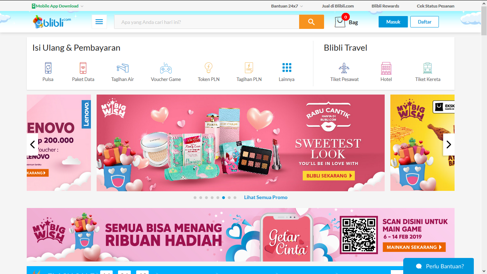

# Example of Appliances / Features with Bad Design
Assigment 0 in Human and Computer Interaction

Name : Vinsensius Indra S \
NRP  : 05111640000064 \
Class: IMK - A

## 1. Any.do Mobile Apps
Any.do is an application that is used for task management, reminding, and scheduling. You can add a task to list, remove a task, or adding a task within a specific time.
### 1.1 What's bad?
- **Task cannot be scheduled automatically** this makes the schedule looks not organized, and difficult to search.
- **No warning when creating same task** this makes the plan can consist of multiple same items.

### 1.2 Suggestion
- Automatically sorting list when a task is added to the list
- Double checking multiple task confirmation

## 2. Blibli.com Desktop Homepage
Blibli.com is a online marketplace.

### 2.1 What's bad?
- **Too many elements that not focused on product** there is more explanation of affilation and partner at the homepage.
- **Misplaced description** it's bad to have long description in homepage.
- **Text has small letters and hard to read** very small size and has similar color to the background.

### 2.2 Suggestion
- **Making 'About Us'** replace that in about us dropdown / tab.

## 3. Electric Switch
Classic switches for distributing electricity to an electric appliance.

### 3.1 What's bad?

- **Same in visuals but different functions** sometimes I forgot where is the right switch that i want to turn on.
- **Inconsistent**, the switch will turn on the light if I press it down, but there are some kinds of switches that also will turn on when I press it up.

### 3.2 Suggestion
- ** Give the switch different label or color ** will make it easy to know the functionality of the switches.
- ** Install smart detector switches ** , for example : clapping sensor, voice sensor.